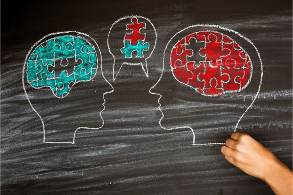

# Introduction to Statistics
#### 統計学入門

Week 1 | September 29, 2022

# Welcome.
 
 
 
 
 
 

# Hello!

## Call me "Yoh"

## 

[My journey](https://yohman.github.io/21S-DH151/Weeks/Week01/misc/me.html)

##

##

##

# Your turn! | あなたの番

- your name | 名前
- your passion | 最近ハマってるもの
- your research interest | 研究するとすればこんなことやってみたい

## My teaching philosophy 私の教育哲学
### 1: class = community

### 2: it's a two way street

Source: LA Times

### 3: sharing is caring

[Source: CDTA Law](https://cdtalaw.com/cdta/the-importance-of-sharing-knowledge-in-any-legal-context/)

# Join the class!

#### Step 1

### Step 2

# What is  Statistics? 統計学とは？

思い浮かぶものを[Jam Board](https://jamboard.google.com/d/1fpDY3gXknDqWB2EsulGxB7Y_NH0uH5FC5FUjHhv7Jjc/edit?usp=sharing)に書いてね

# Some definitions

## **Statistics(統計学）**
a collection of methods for collecting, displaying, analyzing, and drawing conclusions from data.

## **Descriptive statistics（記述統計）**
the branch of statistics that involves organizing, displaying, and describing data.

## **Inferential statistics（推測統計)**
the branch of statistics that involves drawing conclusions about a population based on information contained in a sample taken from that population.

## **Qualitative data(定性的データ)**
measurements for which there is no natural numerical scale, but which consist of attributes, labels, or other non-numerical characteristics.

## **Quantitative data(定量的データ)**
numerical measurements that arise from a natural numerical scale.

## Stats are everywhere

Weather
Disease
Politics
Insurance
Sports
Netflix!

#

https://www.reitaku-u.ac.jp/about/data/
#

#

#

#

## 

https://www.statsperform.com/opta-football/

##

##

##

https://plan-ltd.co.jp/plog/12136

# Let's play with Excel

# Textbooks｜教科書

##

【タイトル】
プレステップ統計学I

【著者】
稲葉由之

【発行社】
弘文堂

【定価】
1980円

教科書は必ず購入してください。

### Do you have Excel?

## Schedule スケジュール

Week | Topic | English
--|--|--
Week 1 | オリエンテーション：統計学とは？ | What is Statistics? 
Week 2 | 統計データの分類(第2章) |  Measurement scales
Week 3 | 統計データの集計(第3章) | Aggregation

###

Week | Topic | English
--|--|--
Week 4 | 統計表のグラフ表現(第4章) | Graphs and charts 
Week 5 | 中心の位置の統計量(第5章) | Centrality: means, medians
Week 6 | 変化を表す統計量(第6章) | Variance, standard deviation

###
Week | Topic | English
--|--|--
Week 7 | 演習1(1~6章の復習問題) | Review day 1
Week 8 | 散らばりの統計量(第7章) | Midterm Presentations
Week 9 | 標準偏差の活用(第8章) | Standard deviation usage

###
Week | Topic | English
--|--|--
Week 10 | 散らばりのグラフ表現(第9章) | Box plots
Week 11 | 2変数の関連性(第10章) | Covariance
Week 12 | 演習2(7~10章の復習問題) | Review day 2

###
Week | Topic | English
--|--|--
Week 13 | 統計データの入手方法(第11章) | Acquiring data
Week 14 | 統計データの整理(第12章) |  Data management 
期末試験 | 日程は別途広報します。 |  Final Presentation 

## Grading｜成績評価

- 毎週課題（14回） 70%
- 期末試験 30%

<small>*出席率60%以上で評価対象となります
(大学全体と同様)</small>

# Assignment | 今週の宿題

Fill out [this survey](https://forms.gle/RYacZUHTGbAf5cuz8)
この[サーベイ](https://forms.gle/RYacZUHTGbAf5cuz8)を提出

金曜日の夜11時59分まで

# Next week

第2章：統計データの分類（pp.18-30）

