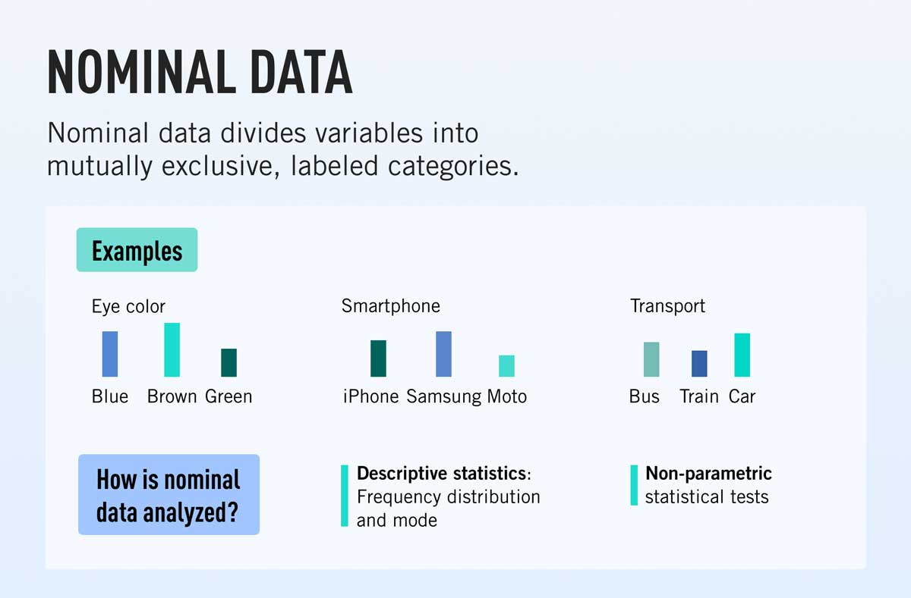
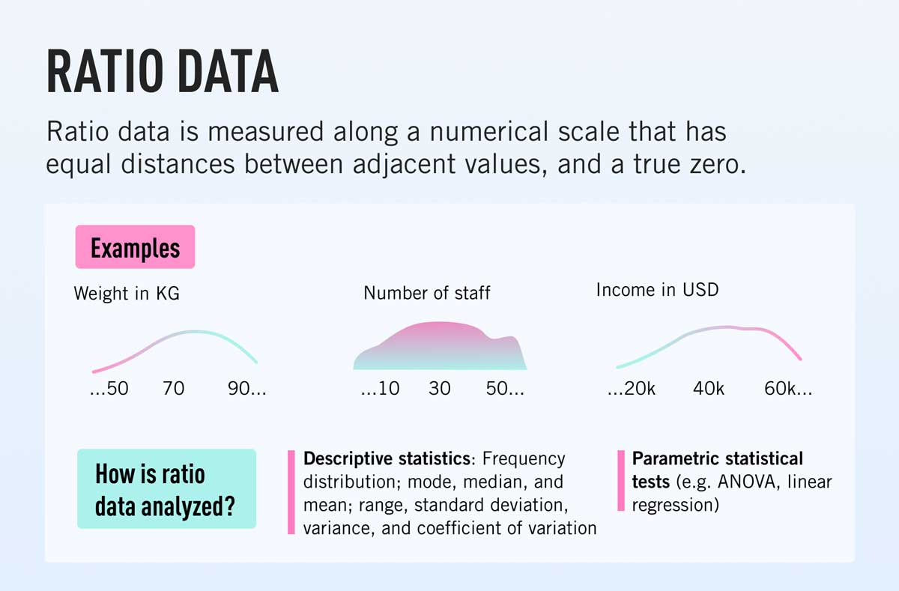
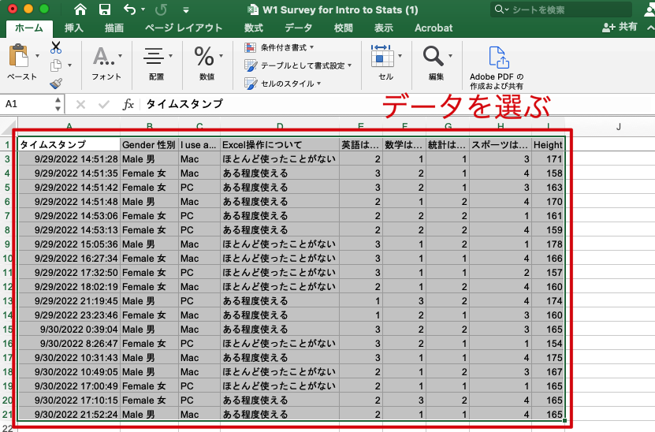
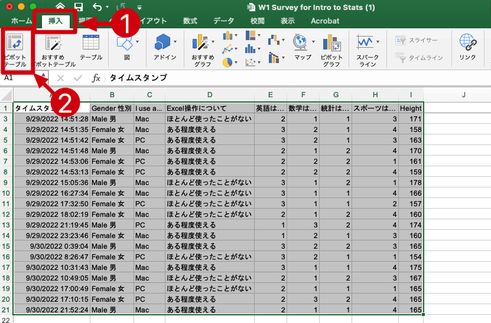
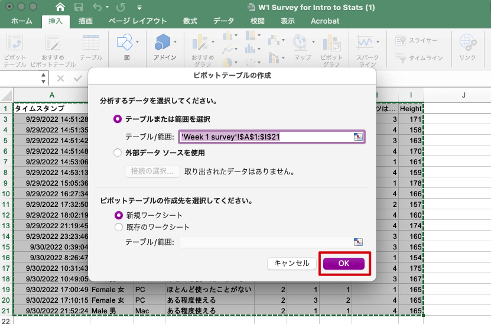
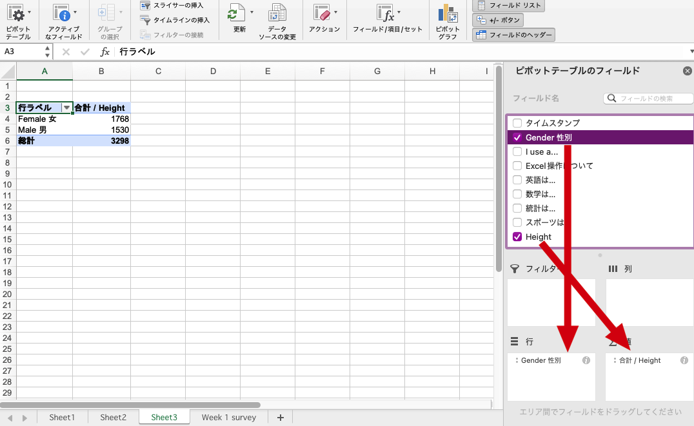
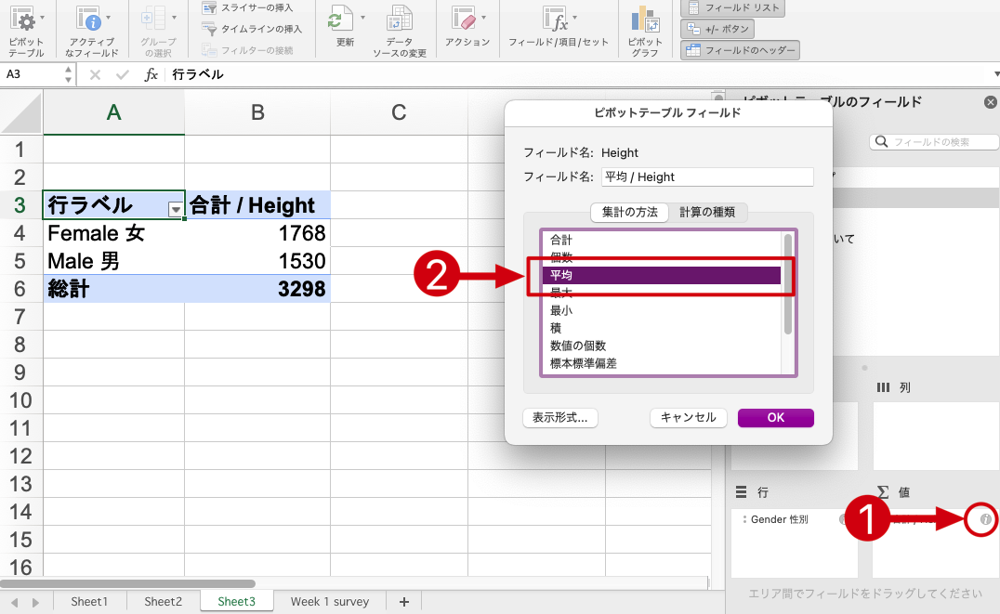
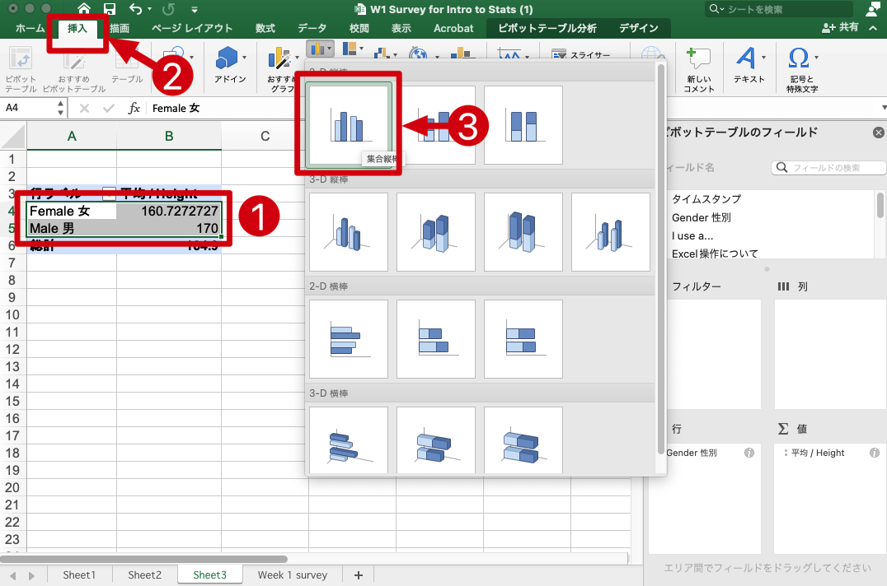

# Introduction to Statistics
#### 統計学入門

Week 2 | October 6, 2022

# What's up?😎
 

## Your answers from last week...

[Week 2 poll results](https://docs.google.com/forms/d/15yvrcP6--I7i2EgMKCu7p85PrVUlSOL0FgLtvjIi_vk/edit#responses)

## Your questions...

## Your questions...

## Your research interests

<small>[Word cloud generator](https://techblog.gmo-ap.jp/2021/06/15/text-visualization-wordcloud/) | [Source code](https://colab.research.google.com/drive/1IA7fCYOBz2L-6k05peqN8qMq8qR0H82H#scrollTo=1jguZnY50RxL)</small>

## Data types

## 1 名義尺度 Nominal data

- 量的じゃない duh!
- 順番がつけられない
- 数を数えて棒グラフで表すことが多い📊📊

## 例えば
**Examples of nominal data**

What languages do you speak?
- English
- Korean
- Japanese
- Spanish
- 関西弁

##

What is your nationality?
- Japanese 🇯🇵  
- German 🇩🇪
- Indian 🇮🇳
- I am from Mars 👽

##

What is your blood type?
- A
- B
- AB
- O

##

How do you commute to Reitaku University?
- I walk🚶🏼‍♂️
- I ride my bicycle🚲
- I take the bus 🚌
- I take the train 🚃
- I drive 🚗
- Other

## 2 順序尺度 Ordinal data 

- 量的ではない duh!!
- Nominalと似てるけど順番に意味がある
- 順番を数字で表すことはあるが、測れない

##
**Examples of ordinal data**

## 最終学歴👩🏻‍🎓
- 中卒
- 高卒
- 専門学高卒
- 大卒
- 大学院卒

↕️

## 数学は得意ですか？🧮
- 苦手
- ちょっと苦手
- まーまー
- 得意

↕️

## 統計学の成績📈
- A
- B
- C
- D

↕️

## 3 Interval data 間隔尺度
- can be measured, 測れる！
- it has continuous, numeric values, 数的であれ
- it can have negative values, マイナスにもなれる

## Examples of interval data 間隔尺度

今日の気温は？
西暦何年？
あなたの年齢は？
テストの点数は？

## 4 Ratio (proportional) data 非列尺度

- has a true zero, ゼロが原点である
- no negative values, マイナスは不可能
- it is proportional, 数字を倍にしたら意味がある

## Examples of ratio data 非列尺度

あなたの身長は？
昨夜の睡眠時間は？
あなたの給料は？
自転車の値段は？

## Why is this important?

## 

To determine how you can analyze your data
これによって、どんな統計ができるかが決まる

##

##

##

##

## Excel playhouse 📊

ではExcelで遊びましょう

まずはデータを取り込もう

## 今日のテーマ：Pivot tables 🔁

##
**チャレンジ問題１ 👩🏻‍💻**

身長(height)の次の値を調べよう：
- Total
- Average
- Median
- Max
- Min

##
**チャレンジ問題2 👨🏻‍💻**

男女の比率が分かるグラフを作ろう

#### 🦸🏼‍♀️👩🏼‍🚀👩🏼‍🎨🧗🏼‍♀️🧙🏼‍♀️🧛🏼‍♀️
#### 👨🏼‍🎤👨🏼‍🍳👨🏼‍🌾👨🏼‍🔬👨🏼‍✈️🕵🏼‍♂️

##
**チャレンジ問題2 👨🏻‍💻**

男女別の平均身長を調べよう

##

##

##

##

##

##

# Assignment | 今週の宿題🧐

#### [小テスト](https://forms.gle/6JRvA34jTLhHLDtPA)

金曜日の夜11時59分まで

# Next week

次回第3回授業の予習範囲は、第3章：統計データの集計（pp.31-41）です。

