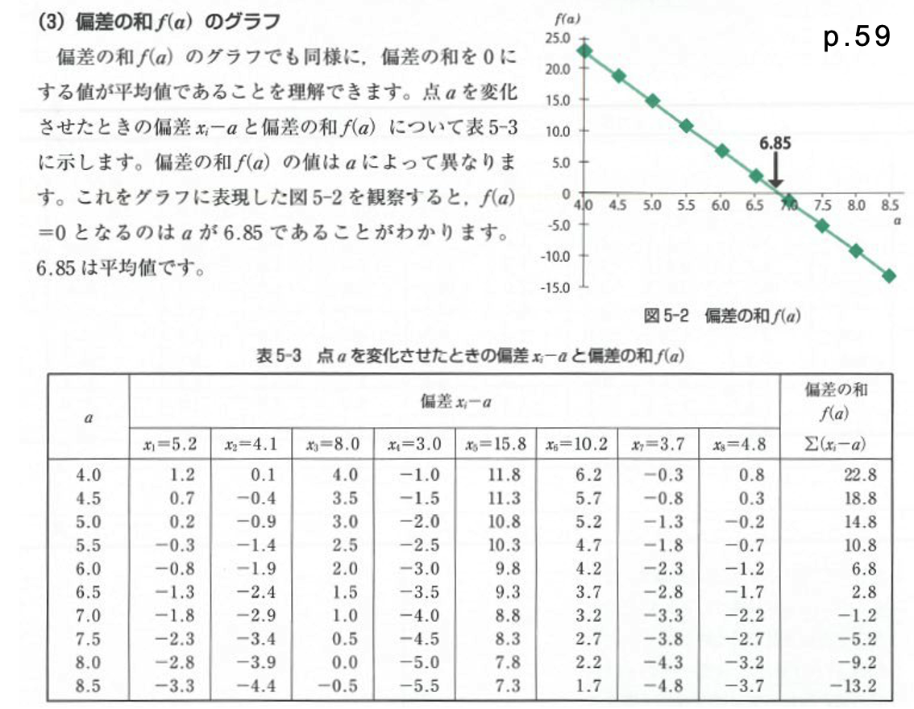

# Introduction to Statistics
#### 統計学入門

Week 5 | October 27, 2022

# What's up?😎
 
 
 
 
 
 
 
 
 

##

[bison親子](https://photos.app.goo.gl/UmhT5wgqPFya6JM38)

## なぜ小テスト？

#### 😖 😠 😾 😤

## 統計検定

##

##

https://www.toukei-kentei.jp/exam/

##

##

##

##

## Week 4 小テスト
#### 😬 😱 🫦 🙀

##

##

##

##

##

##

##

##

##

##

##

## Welcome to Sigma

Σ

##

## Excel playground #1

1. Google Classroomから今週のExcel Fileをダウンロード
2. シート「１平均値と中央値」を開く
3. 平均値と中央値を関数を使わないで出す

## 偏差値からの偏差の和は０

##

$\sum_{i=1}^n (x_i-a)$
 
- $x_i$ は一人一人の身長を表す
- $a$が平均身長だとすると…

##

$\sum_{i=1}^n (x_i-a) = 0$
 
- この式がゼロになる！
- これをクラスのデーターで 検証してみましょう

## Excel playtime #2

1. シート「2 クラス身長」を開く
1. 平均身長を計算
1. 偏差：各生徒の平均身長との差を計算する列を作る
1. 偏差を計算した列の合計を出して、ゼロであることを確認
1. 身長と偏差の列で散布図を作る

##

## 仮の平均値

## Excel playtime #3：仮の平均値

1. シート「3 アニメ身長」を開く
1. 自分で平均身長を想定して新しい列に書き込む
1. 隣にまた新しい列を作って、偏差を計算する
1. 偏差列の合計を出す
1. その合計から列の数を割る
1. 想定した身長に足したら平均が出ます

## Excel playtime #4
#### 2組の平均値から全体の平均値？

1. シート「4 男女平均身長」を開く
1. 全体の平均身長を計算して出す

