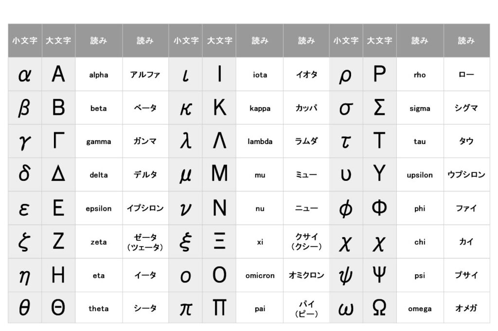

# Introduction to Statistics
#### 統計学入門

Week 6 | November 3, 2022

# What's up?😎
 
 
 
 
 
 
 
 
 

## Week 5 小テスト
#### 😬 😱 🫦 🙀

##

##

##

##

##

##

##

##

##

##

##

# Welcome to Delta

Δ

## The Greek alphabet
In math, "delta" means "variation" or 変化

## Let's do some math
実数値の変化（増加・減少）

vs

比率の変化（上昇・低下）

## Group activities

- 4-5人のグループ
- 何かの変化を表す統計量の記事を見つける
- 記事のスクリーンショットを撮って[このグーグルスライド](https://docs.google.com/presentation/d/1xd2lxjMbXwVGx8SZcFuKdC6Z7pIsWPMBbU3EkpzV9rM/edit?usp=sharing)に載せる
- スライドにリンクも載せる
- 約10分後に発表

## Excel playground

##

1. Go to: https://www.mhlw.go.jp/stf/covid-19/open-data.html
1. 死亡者数（累積）をダウンロードする
1. Excelで開く

## Observations

- What does the data look like?
- At first glance, what does it tell you?
- What statistics can you provide without doing any calculations?

## Analysis

- グループで相談しながら、色んな統計を出して発表する（10分）

## Data visualization

- 好きな都道府県を選ぶ（グループ同士で被らないように）
- 死亡日別による死亡者数の推移（累計）を表すグラフを作成する
- 先ほどのグーグルスライドに載せる
- 違う都道府県と比較するグラフを作成し、スライドに載せる

## Time difference

- 自分の都道府県の隣に新しい行を作る
- 前日との差を計算し、その日の死者数を表す
- 死亡日別による死亡者数の推移（日別）のグラフを作る
- 違う都道府県と比較するグラフを作成し、スライドに載せる

