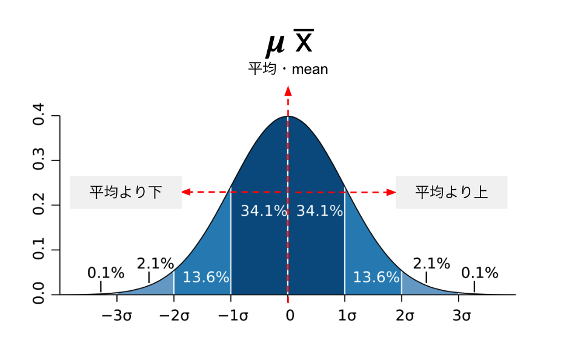

# Introduction to Statistics
#### 統計学入門

Week 8 | November 17, 2022

## Week 7 中間テスト
#### 😬 😱 🫦 🙀

##

##

##

##

##

##

##

##

##

##

##

##

##

##

##

##

##

##

##

##

##

##

##

##

##

##

##

##

##

##

##

##

##

##

##

##

##

##

##

## 正規分布

The "bell" curve

##

##

### For example...

USA Men and Women Heights
gender|mean| σ
---|:---|:---
Men|70" (178cm)|3"(7.5cm)
Women|63.5"(161cm)|2.5"(6.4cm)

## Group activity

ここから：

[体力・運動能力調査](https://www.e-stat.go.jp/stat-search/files?page=1&layout=datalist&toukei=00402102&tstat=000001088875&cycle=0&tclass1=000001133904&tclass2val=0)

興味がある課題を選んで、エクセルで拝見する
グループで観測した結果を発表

## 
𝝈
sigma

##

<table width=100%>
<tr>
<td>
𝜮
</td>
<td>
𝝈
</td>
</tr>
<tr>
<td>足し算 sum</td>
<td>標準偏差 standard deviation</td>
</tr>
</table>

##

𝝁 

平均・mean  

##

$$\bar{x}$$

平均・mean

### 標準偏差の公式

$$s = \sqrt{\frac{1}{N} \sum_{i=1}^N (x_i - \overline{x})^2}\$$

### 標準偏差の公式(2)

$$ \sigma =\sqrt{\frac{1}{N}\sum\limits_{i=1}^N (x_i - \mu)^2} $$

###

$$s = \sqrt{\frac{1}{N} \sum_{i=1}^N (x_i - \overline{x})^2}\$$

$$ \sigma =\sqrt{\frac{1}{N}\sum\limits_{i=1}^N (x_i - \mu)^2} $$

symbol|symbol
---|:---
s・σ|標準偏差
N|データの総数（例：10000個）
Xi|各データの値（例：198cm）
x̅・ μ|データの平均（例：177cm）

### Excel playground

