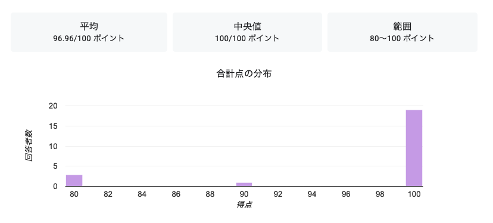
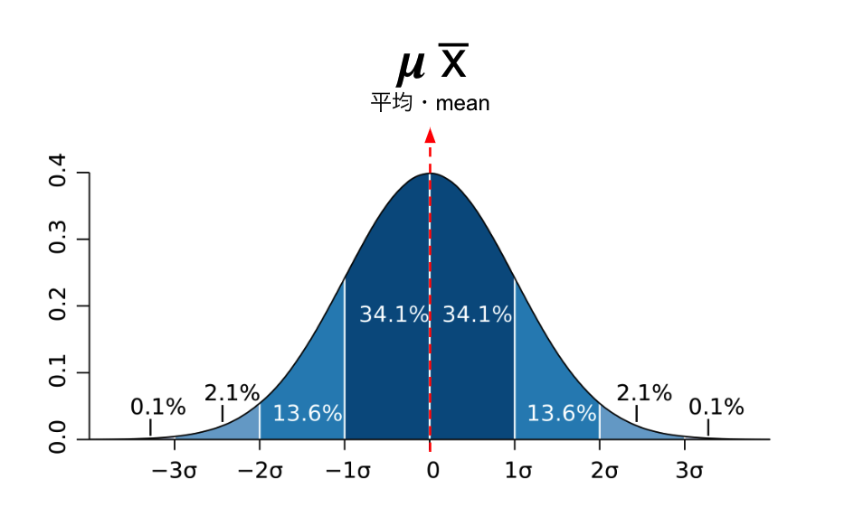
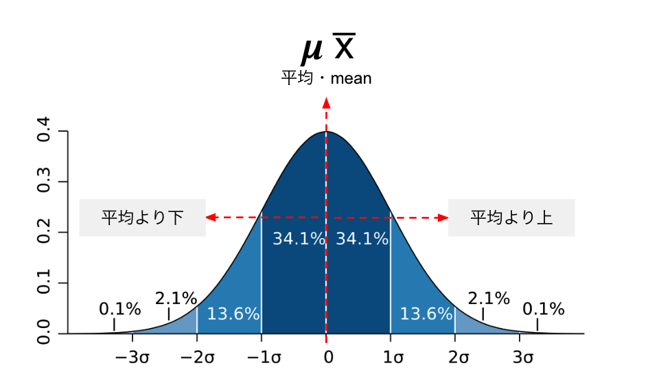
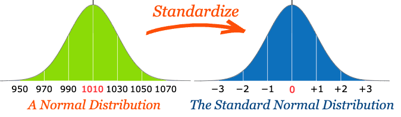

# Introduction to Statistics
#### 統計学入門

Week 9 | November 24, 2022

### 

 
 
 
 
 
 
 
 
 
 

### 

 
 
 
 
 
 
 
 
 
 

## Week 8 小テスト
#### 😬 😱 🫦 🙀

##

## Last week

### 正規分布

The "bell" curve

##

##

# チェビシェフの不等式 
Chebyshev's inequality

What if data was not normally distributed?

##

# 変動係数 Coefficient of Variation
分布の拡がりを表現する統計量
## 

CV= σ/μ
​
変動係数 = 標準偏差/平均値
​

### Example：

[1,2,3]

[100,101,102]

### Example 2: ホテル🇯🇵vs🇺🇸

[¥10000,¥20000,¥30000]

[$70,$140,$210]

# 標準化とZ値 Z-Score

### 

このクラスの平均身長
165cm(μ)
標準偏差
7cm(σ)
先生の身長は177cm ➡︎ 標準化すると？

###

###

###

###

###

(177-165)/7 = 1.71

(求める身長-平均値)/標準偏差 = 標準化した変数

### すなわち

###

https://www.mathsisfun.com/data/standard-normal-distribution-table.html

### 
では、あなたは？

### Excel playground

