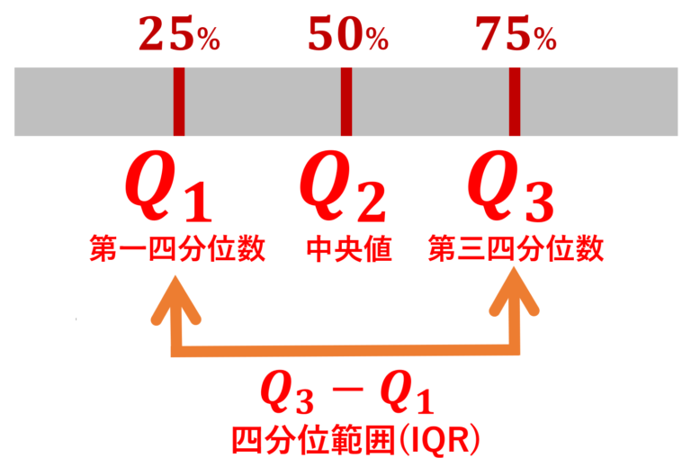

# Introduction to Statistics
#### 統計学入門

Week 10 | December 1, 2022
### 

https://www.nytimes.com/interactive/2022/upshot/japan-world-cup-scores-standings.html

## Week 9 小テスト
#### 😬 😱 🫦 🙀

##

## Last week

### 正規分布

The "bell" curve

# チェビシェフの不等式 
Chebyshev's inequality

What if data was not normally distributed?

##

# 変動係数 Coefficient of Variation
分布の拡がりを表現する統計量
## 

CV= σ/μ
​
変動係数 = 標準偏差/平均値
​

# 標準化とZ値 Z-Score

### 

このクラスの平均身長
165cm(μ)
標準偏差
7cm(σ)
先生の身長は177cm ➡︎ 標準化すると？

###

###

###

###

###

(177-165)/7 = 1.71

(求める身長-平均値)/標準偏差 = 標準化した変数

### すなわち

### 散らばりのグラフ表現

Image source: https://mathlandscape.com/box-plot/

###

データの5数要約を計算する：
四分位＝quartile

0. 最小値（MIN)
1. 第１四分位点（Q１)
1. 中央値（Q２)
1. 第３四分位点（Q3）
1. 最大値（MAX)

###

Boxをかく

###

Image source: https://mathlandscape.com/box-plot/

###

ではやってみよう

###

Box with whiskers (外れ値)

Image source: https://mathlandscape.com/box-plot/

###

###

Animeの身長データで
やってみよう

###

###

###

###

###

###

外れ値ありの箱ヒゲ図は？

### Group Activity

###

1. Choose a world cup team:
https://soccer.yahoo.co.jp/wcup/category/2022/teams

###

選手データを選択 ➡︎ Excelにコピペ

###
Excelで身長/体重の列をスプリット

###

その国の選手の次の5数要約を計算する：

0. 最小値
1. 第１四分位点
1. 中央値
1. 第３四分位点
1. 最大値

###

###

Draw a box and whisker diagram!
