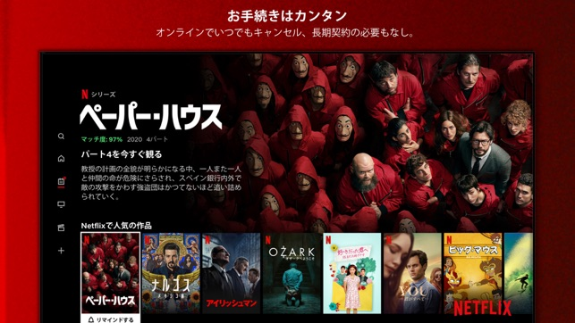

# Introduction to Statistics
#### 統計学入門

Week 12 | December 15, 2022

### 今後のスケジュール

Week|Date|Topic
:--|:--|:--
12|12/15/22（今日）|統計データの入手方法
13|12/22/22|R入門
14|1/12/23|演習（期末テスト対策）
15|1/18/23(水曜11時40分)|期末テスト

## Week 11 小テスト
#### 😬 😱 🫦 🙀

##

##

統計データの入手方法

##

データの色んな形

##

Excel

##

アンケートからのデータ

##

##

##

Netflix

##

集められるあなたのデータ
- 年齢
- 性別
- 家族構成
- 住んでいる場所
- 好みのジャンル
- 好みの俳優
- 見る頻度
- 見る時間帯
- などなど…

##

##

##

##

日本、世界の状況を表すデータ

https://dashboard.e-stat.go.jp/

##

## Activity 1

時系列グラフを作ろう

##

https://dashboard.e-stat.go.jp/

##

興味のある課題を選ぶ

## 

1. [estat](https://dashboard.e-stat.go.jp/)から時系列データをダウンロード、エクセルで開く
2. 統計、ピボットテーブルを使ったり、グラフを作る
3. クラスの[galleryスライド](https://docs.google.com/presentation/d/1DhyVRbH1XzfVT5Sp7G7Zq0f8q92SAp6FrmEpRUfTtu0/edit?usp=sharing)にコピペ
4. 何個でもオッケー！

## Activity 2

自転車盗難：大学生の被害者の割合は？

Source: [警視庁](https://www.npa.go.jp/toukei/seianki/hanzaiopendatalink.html)

## Activity 3

自分で課題を考えよう

## 
https://www.stat.go.jp/data/sekai/notes.html#mokuji

